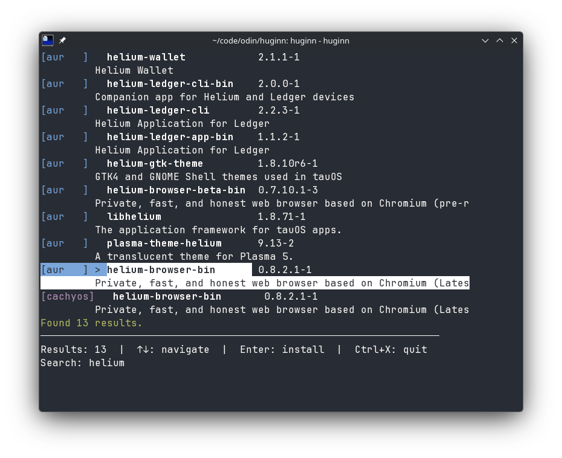

# Huginn

A simple TUI Arch User Repository (AUR) interactive search tool built in `Odin` on top of `paru`.



> ⚠️ requires paru to run [link](https://github.com/Morganamilo/paru)

# Installation

## Tarball

On x86_64 just grab the tarball:

```bash
curl -L -O https://github.com/krisfur/huginn/releases/download/v1.0.2/huginn-v1.0.2-linux_x86_64.tar.gz
tar -xzf huginn-v1.0.2-linux_x86_64.tar.gz
sudo cp huginn-v1.0.2-linux_x86_64/huginn /usr/local/bin/huginn
```

You still need `Paru` [link](https://github.com/Morganamilo/paru) installed to use it. If missing use:

```bash
git clone https://aur.archlinux.org/paru.git
cd paru
makepkg -si
```

## From source

Prerequisites: 
- `paru` [link](https://github.com/Morganamilo/paru)
- `odin` [link](https://odin-lang.org/docs/install/)

```bash
git clone https://github.com/krisfur/huginn.git
cd huginn
odin build .
```

then you can simply run the resulting executable

```bash
./huginn
```

to make it callable from anywhere simply copy it to your local bin folder like:

```bash
sudo cp huginn /usr/local/bin/huginn
```

or manually add it to path.

## tl;dr give me the full commands (from source)

paru:
```bash
sudo pacman -S --needed base-devel
git clone https://aur.archlinux.org/paru.git
cd paru
makepkg -si
```
odin:
```bash
paru -S odin-git
```
huginn:
```bash
git clone https://github.com/krisfur/huginn.git
cd huginn
odin build .
sudo cp huginn /usr/local/bin/huginn
```
